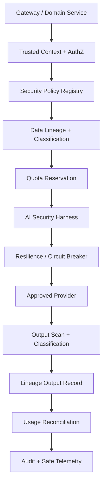

# V2.2 Architecture Diagrams

See `Core_Platform_Technical_Specification_V2.2.md` sections 3 and 10 for embedded Mermaid diagrams.

## Control-plane flow

```mermaid
flowchart TB
  API[Gateway / Domain Service] --> AUTH[Trusted Context + AuthZ]
  AUTH --> POLICY[Security Policy Registry]
  POLICY --> LIN[Data Lineage + Classification]
  LIN --> Q[Quota Reservation]
  Q --> HARNESS[AI Security Harness]
  HARNESS --> ROUTE[Resilience / Circuit Breaker]
  ROUTE --> PROVIDER[Approved Provider]
  PROVIDER --> SCAN[Output Scan + Classification]
  SCAN --> LINEOUT[Lineage Output Record]
  LINEOUT --> RECON[Usage Reconciliation]
  RECON --> AUDIT[Audit + Safe Telemetry]
```
