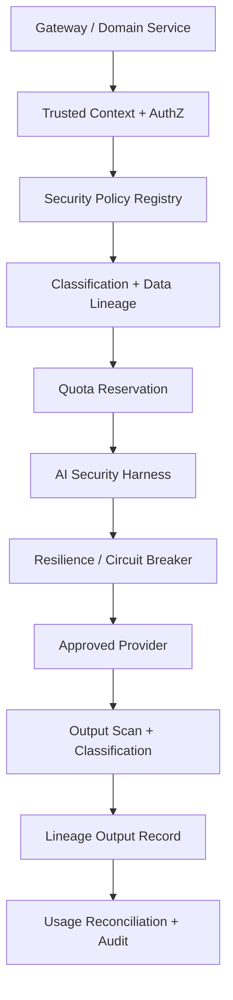
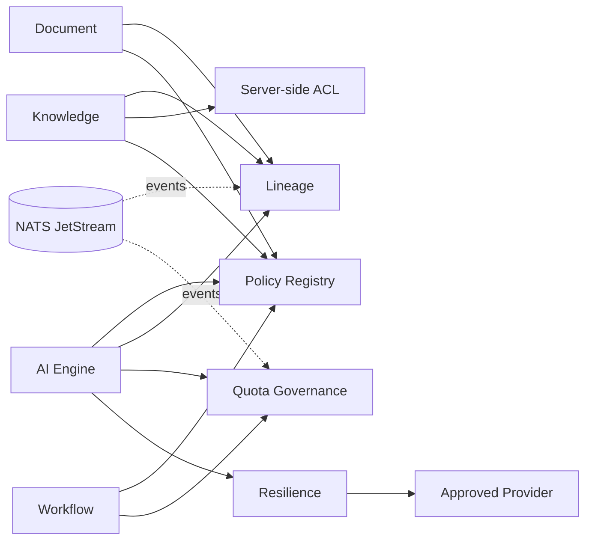

# V2.2 Architecture Diagrams

The authoritative overview is embedded in `Core_Platform_Technical_Specification_V2.2.md`.

## Protected AI request flow

```mermaid
flowchart TB
 A[Gateway / Domain Service] --> B[Trusted Context + AuthZ]
 B --> C[Security Policy Registry]
 C --> D[Classification + Data Lineage]
 D --> E[Quota Reservation]
 E --> F[AI Security Harness]
 F --> G[Resilience / Circuit Breaker]
 G --> H[Approved Provider]
 H --> I[Output Scan + Classification]
 I --> J[Lineage Output Record]
 J --> K[Usage Reconciliation + Audit]
```

## Control-plane dependencies

```mermaid
flowchart LR
 DOC[Document] --> LIN[Lineage]
 KNOW[Knowledge] --> LIN
 KNOW --> AUTHZ[Server-side ACL]
 DOC --> REG[Policy Registry]
 KNOW --> REG
 AI[AI Engine] --> REG
 AI --> LIN
 AI --> Q[Quota Governance]
 AI --> R[Resilience]
 WF[Workflow] --> REG
 WF --> Q
 R --> P[Approved Provider]
 BUS[(NATS JetStream)] -. events .-> LIN
 BUS -. events .-> Q
```
